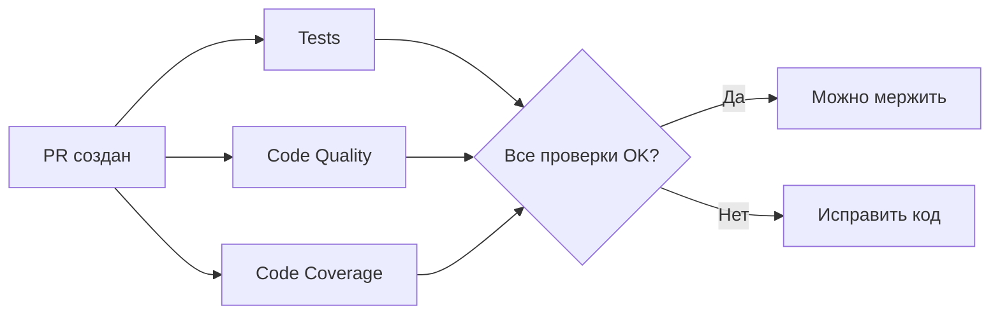
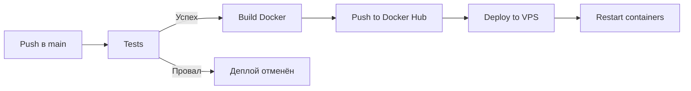

# CI/CD Pipeline

Автоматизация тестирования, проверки качества кода и деплоя через GitHub Actions.

## 📋 Workflows

### 1. Tests (`tests.yml`)

**Триггеры:**

- Push в ветки: `main`, `master`, `develop`
- Pull Request в ветки: `main`, `master`, `develop`

**Что делает:**

- ✅ Запускает PostgreSQL в контейнере
- ✅ Устанавливает .NET 9.0
- ✅ Восстанавливает зависимости
- ✅ Собирает проект
- ✅ Запускает все unit тесты
- ✅ Генерирует отчёт о тестах
- ✅ Загружает результаты как артефакты

**Статус:** Обязательный для merge

### 2. Deploy to VPS (`deploy.yml`)

**Триггеры:**

- Push в ветки: `main`, `master`
- Ручной запуск (workflow_dispatch)

**Что делает:**

1. **Этап тестирования:**
    - ✅ Запускает все тесты
    - ❌ Если тесты провалились — деплой не происходит

2. **Этап деплоя** (только если тесты прошли):
    - ✅ Собирает Docker образ
    - ✅ Загружает в Docker Hub
    - ✅ Подключается к VPS по SSH
    - ✅ Обновляет контейнеры

**Статус:** Автоматический после успешных тестов

### 3. Code Coverage (`code-coverage.yml`)

**Триггеры:**

- Push в ветки: `main`, `master`, `develop`
- Pull Request в ветки: `main`, `master`

**Что делает:**

- ✅ Запускает тесты с покрытием кода
- ✅ Генерирует отчёт о покрытии
- ✅ Добавляет комментарий в PR с результатами
- ✅ Загружает данные в Codecov (опционально)

**Пороги:**

- 🟢 Отлично: > 80%
- 🟡 Хорошо: 60-80%
- 🔴 Плохо: < 60%

### 4. Code Quality (`code-quality.yml`)

**Триггеры:**

- Push в ветки: `main`, `master`, `develop`
- Pull Request в ветки: `main`, `master`

**Что делает:**

- ✅ Проверяет форматирование кода (`dotnet format`)
- ✅ Собирает с warnings as errors
- ✅ Запускает .NET analyzers
- ✅ Проверяет безопасность кода

**Статус:** Рекомендуемый для merge

## 🔄 Процесс CI/CD

### При создании Pull Request



1. Автоматически запускаются:
    - ✅ Tests
    - ✅ Code Quality
    - ✅ Code Coverage

2. В PR добавляется комментарий с покрытием кода

3. Статусы проверок отображаются в PR

4. Merge возможен только после успешных тестов

### При Push в main/master



1. Запускаются тесты
2. Если тесты успешны → сборка Docker образа
3. Загрузка в Docker Hub
4. Автоматический деплой на VPS
5. Перезапуск контейнеров

## 🛠️ Настройка

### Требуемые GitHub Secrets

Для работы CI/CD нужны следующие секреты в `Settings` → `Secrets and variables` → `Actions`:

| Секрет            | Описание                   | Обязательный        |
|-------------------|----------------------------|---------------------|
| `DOCKER_USERNAME` | Username от Docker Hub     | ✅ Да (для деплоя)   |
| `DOCKER_PASSWORD` | Пароль от Docker Hub       | ✅ Да (для деплоя)   |
| `VPS_HOST`        | IP адрес VPS сервера       | ✅ Да (для деплоя)   |
| `VPS_USERNAME`    | SSH username (обычно root) | ✅ Да (для деплоя)   |
| `VPS_SSH_KEY`     | Приватный SSH ключ         | ✅ Да (для деплоя)   |
| `CODECOV_TOKEN`   | Токен Codecov              | ❌ Нет (опционально) |

### Настройка Branch Protection Rules

Рекомендуется настроить защиту ветки `main`:

1. Перейдите в `Settings` → `Branches`
2. Добавьте правило для `main`
3. Включите:
    - ✅ Require status checks to pass before merging
    - ✅ Require branches to be up to date before merging
    - ✅ Status checks: `Run Tests`
    - ✅ Require pull request reviews before merging

## 📊 Мониторинг

### Просмотр статуса workflows

1. Откройте репозиторий на GitHub
2. Перейдите во вкладку `Actions`
3. Выберите нужный workflow

### Просмотр результатов тестов

1. Откройте конкретный workflow run
2. Перейдите в `Summary`
3. Скачайте артефакты `test-results`

### Просмотр покрытия кода

1. В Pull Request смотрите комментарий от бота
2. Или откройте workflow `Code Coverage` → `Summary`

## 🔧 Локальная проверка перед push

### Запуск тестов

```bash
dotnet test
```

### Проверка форматирования

```bash
dotnet format --verify-no-changes
```

### Автоматическое форматирование

```bash
dotnet format
```

### Проверка с покрытием

```bash
dotnet test --collect:"XPlat Code Coverage"
```

### Сборка с warnings as errors

```bash
dotnet build /p:TreatWarningsAsErrors=true
```

## 🚀 Ручной деплой

Если нужно задеплоить без push:

1. Перейдите в `Actions`
2. Выберите `Deploy to VPS`
3. Нажмите `Run workflow`
4. Выберите ветку
5. Нажмите `Run workflow`

## 📈 Метрики качества

### Целевые показатели

- **Code Coverage**: > 80%
- **Build Success Rate**: > 95%
- **Deployment Success Rate**: > 99%
- **Test Pass Rate**: 100%

### Мониторинг метрик

Метрики доступны в разделе `Insights` → `Actions`:

- Время выполнения workflows
- Процент успешных запусков
- Использование минут GitHub Actions

## 🐛 Troubleshooting

### Тесты падают в CI, но работают локально

**Причины:**

- Разные версии .NET
- Отсутствие PostgreSQL локально
- Разные переменные окружения

**Решение:**

```bash
# Запустите тесты с той же конфигурацией, что в CI
docker run --rm -d -p 5432:5432 \
  -e POSTGRES_DB=FamilyTaskManager_Test \
  -e POSTGRES_USER=postgres \
  -e POSTGRES_PASSWORD=postgres_test_password \
  postgres:16-alpine

export ConnectionStrings__DefaultConnection="Host=localhost;Port=5432;Database=FamilyTaskManager_Test;Username=postgres;Password=postgres_test_password"
dotnet test
```

### Деплой не запускается

**Проверьте:**

1. Все ли секреты настроены?
2. Прошли ли тесты успешно?
3. Есть ли доступ к VPS по SSH?

**Отладка:**

```bash
# Проверьте SSH подключение
ssh -i ~/.ssh/github-actions root@ваш_vps_ip

# Проверьте логи на VPS
ssh root@ваш_vps_ip "docker compose -C /opt/family-task-manager logs"
```

### Code Coverage не работает

**Решение:**

1. Убедитесь, что тесты генерируют coverage
2. Проверьте путь к файлам coverage
3. Установите пакет `coverlet.collector` в тестовом проекте

### Workflow занимает слишком много времени

**Оптимизация:**

1. Используйте кэширование зависимостей
2. Запускайте workflows параллельно
3. Уменьшите verbosity логов

## 📝 Лучшие практики

### Commits

- ✅ Делайте небольшие, атомарные коммиты
- ✅ Пишите понятные commit messages
- ✅ Запускайте тесты локально перед push

### Pull Requests

- ✅ Создавайте PR для каждой фичи
- ✅ Дождитесь успешных проверок перед merge
- ✅ Запрашивайте code review

### Деплой

- ✅ Деплойте только из `main` ветки
- ✅ Убедитесь, что тесты прошли
- ✅ Мониторьте логи после деплоя

## 🔗 Полезные ссылки

- [GitHub Actions Documentation](https://docs.github.com/en/actions)
- [.NET Testing Best Practices](https://learn.microsoft.com/en-us/dotnet/core/testing/)
- [Docker Build Best Practices](https://docs.docker.com/develop/dev-best-practices/)
- [Codecov Documentation](https://docs.codecov.com/)

## 📊 Статус Badges

Добавьте в README.md:

```markdown


```

---

**Готово!** Теперь каждый push автоматически тестируется, а деплой происходит только после успешных тестов. 🎉
